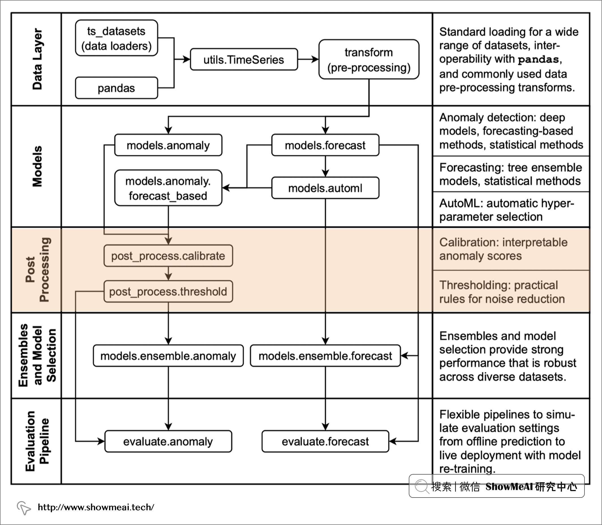

## 基于merlion的时序模型

> 参考https://www.showmeai.tech/tutorials/42?articleId=288

### Merlion 

`merlion`是一个用于时间序列的智能Python 库，提供了一个端到端的机器学习框架，包括加载和转换数据，建立和训练模型，模型结果后处理，以及评估模型性能。Merlion 支持各种时间序列学习任务，包括单变量和多变量时间序列的预测、异常检测和变化点检测。这个库的目的是为工程师和研究人员提供一站式解决方案，快速开发特定的时间序列需求模型，并在多个时间序列数据集上进行基准测试。

#### 架构

### 数据分析

Merlion 的数据结构是 TimeSeries，支持多变量和单变量时间序列。其底层是对一系列 UnivariateTimeSeries 进行的封装。

为了将数据放入所需的数据结构中，我们使用 TimeSeries 的函数 .from_pd()。这个函数接受带有 DatetimeIndex 的 DataFrame 作为输入，并且默认检查每个索引是否唯一以及是否设置了频率 freq（默认1h）。

如果输入的『单变量时间序列』包含缺失值或 nan 值，Merlion 会删除它们及其对应的索引

如果输入的『单变量时间序列』包含缺失值或 nan 值，Merlion 会删除它们及其对应的索引。

在输入『多元时间序列』面临多序列不对齐的情况时，Merlion 工具库可以检查多元时间序列『是否包含任何缺失值』或『每个变量的索引是否未对齐』（调用 TimeSeries 的 .is_aligned 属性）。如果没有对齐（.is_aligned 属性为 False），可以调用 .align() 函数对其进行修复对齐。

除了 .align() 函数，Merlion 带有另外两个方便的函数：

.window(t0, tf) ：在t0和 tf 范围之间切出一个子集，输入参数可以是任何合理的日期时间格式，也可以是 Unix 时间戳。
.bisect(t) ：类似于 .window()，将时间序列分成左右部分。

### 数据处理

### Model